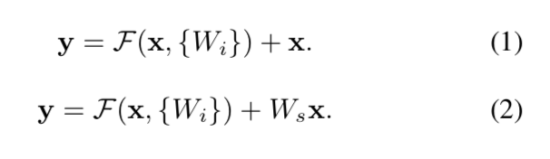
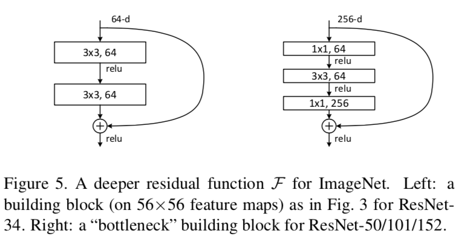
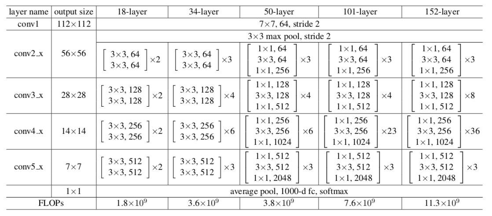
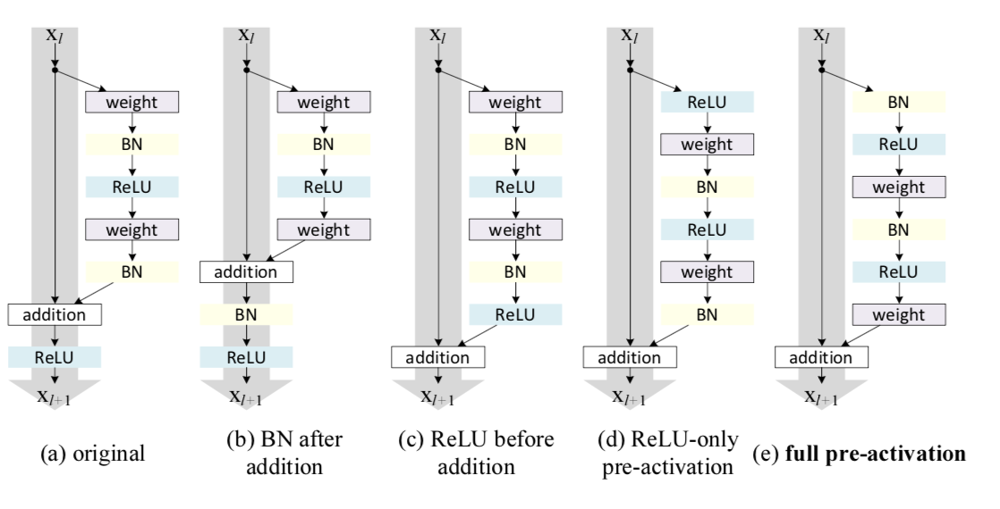
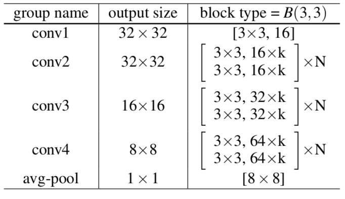
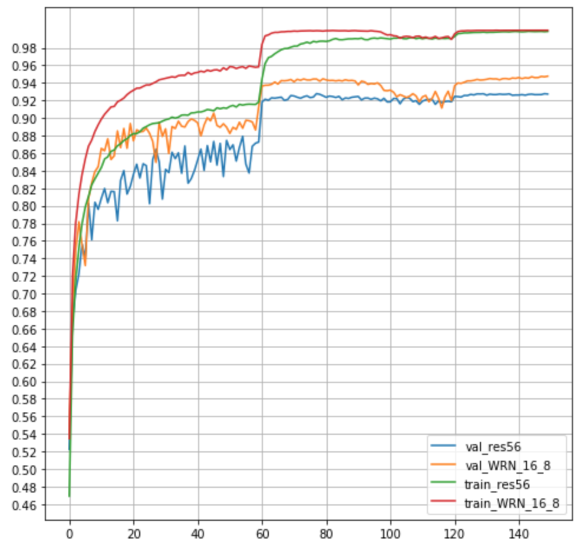

# ResNet #
## 1. original residual network ##
 
ResNet was proposed by Kaiming He et al.

The concept comes from highway network as mentioned by He in their publication. After this network, we know the network can be very deep.

Above equations are the essences of this network, whereas the Eq. 2 can be transformed to bottleneck structure. The very first publication mentioned about identity and projection as their unit blocks as I previously transcribe the two equations above. He also does an experiment to the shortcut attribute between identity and projection blocks. It turns out to use projection shortcut to increase dimensions, and treat other shortcuts as identity are the best solution.

## 2. bottleneck design ##
When the network depth is beyond 50 layers, bottleneck shortcut is the solution to the network. The comparison to the original design and bottleneck structure is shown below.

The table below shows th structure with different layers.

 

## 3. pre-activation ##
 
The successive research of He shows that if we change the position of activation function, the results may be improved.

# WRN (wide residual network) #
Also, a transformation to ResNet is proposed by S. Zagoruyko and N. Komodakis. Since beyond 1000 layer may bring us to overfit due to reuse the feature, to widen the block may be a good option. To widen the block gives us abundance feature and also decreases the depth of the overall network. This idea saves us plenty of time to train the network and get less error rate under the comparable number of parameters.

# Result #

